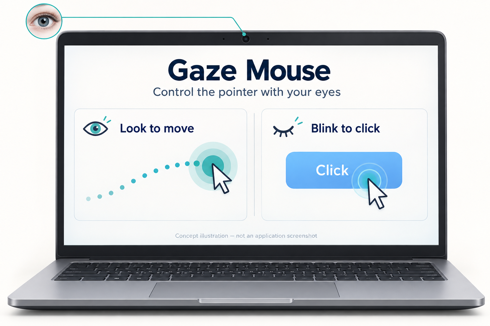
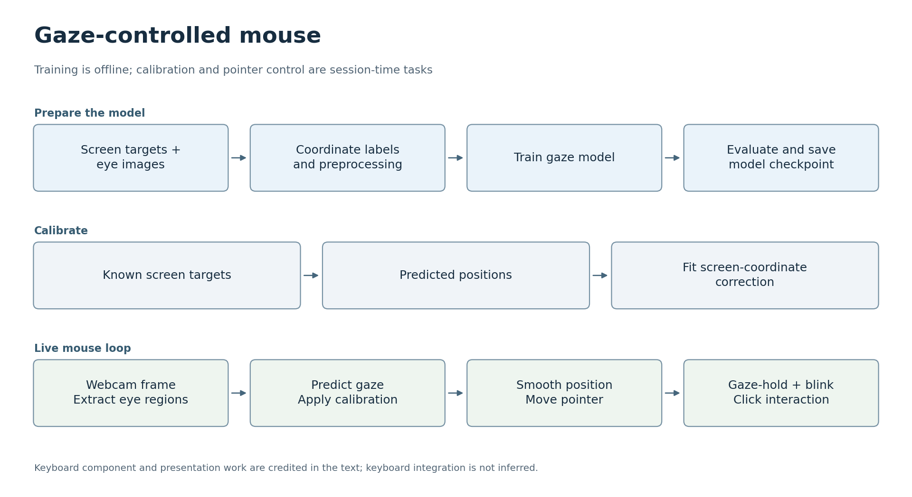

# 시선 추적 마우스

[한국어](#korean) · [English](#english)

## 한국어

시선 추적 마우스는 2025년 영상처리 수업에서 개발한 웹캠 기반 포인터 인터페이스입니다. 사용자가 바라보는 위치를 추정하고, 추정값을 화면 좌표에 맞게 보정해 마우스 포인터를 움직입니다. 전용 시선 추적 장비 없이도 시선을 일정 시간 유지하거나 눈을 깜박이는 방식으로 클릭할 수 있습니다.

[팀 시연 영상 보기](https://www.youtube.com/watch?v=VR9T6X-zanU).

### 프로젝트 목표

전용 시선 추적 장비 없이 일반 웹캠으로 눈의 시선을 이용해 마우스 포인터를 움직이고 클릭하는 것이 목표입니다.

시선 기반 상호작용을 설명하기 위해 AI로 생성한 개념 이미지입니다. 실제 프로젝트 사진이나 애플리케이션 화면 캡처가 아닙니다.

### 활용할 수 있는 곳

손을 사용하지 않는 포인터 조작과 접근성 인터페이스 연구의 출발점으로 활용할 수 있습니다. 일반 마우스를 조작하기 불편한 상황에서 목표를 바라보고 의도적으로 눈을 깜박이거나 시선을 유지하는 방식이 대체 입력 수단이 될 수 있습니다. 실제로 사용하려면 사용자별 보정이 필요하며, 사용 편의성, 의도하지 않은 클릭, 카메라와 조명 조건의 변화에 따른 성능을 평가해야 합니다.

### 전체 흐름

프로젝트 문서와 코드를 바탕으로 재구성한 개략도입니다. 결과와 검증의 한계는 아래에 설명합니다. [SVG](docs/flowcharts/gaze.svg)

### 프로젝트 구성과 팀 역할

이 프로젝트는 정답 라벨이 있는 눈 이미지 수집, 학습된 시선 추정 모델, 보정과 마우스 조작 기능을 갖춘 실시간 인터페이스를 연결합니다. 박상헌은 데이터 수집과 전처리, 모델 구현과 학습, 보정, 포인터 이동과 클릭 동작, 성능 평가와 통합을 수행했습니다. 김선우는 프로젝트의 키보드 구성요소를 개발하고 발표 자료를 준비했습니다.

시선 추정 모델은 공개된 FGI-Net 연구를 기반으로 합니다. 위 역할은 팀이 프로젝트에서 수행한 작업을 설명하며, 원래 모델 연구와 사용한 라이브러리의 출처 및 기여 표기는 별도로 유지됩니다.

### 인터페이스 작동 방식

작업은 실시간 애플리케이션을 실행하기 전부터 시작됩니다. 정답 라벨이 있는 눈 이미지를 수집하고, 시선 추정 모델을 학습·평가한 다음, 호환되는 체크포인트를 불러옵니다. 세션을 시작할 때는 보정을 통해 모델의 추정값과 화면상의 알려진 목표 위치를 짝지어 대응시킵니다. 이후 실시간 처리 루프에서 프레임을 촬영하고, 눈 영역을 추출하고, 위치를 예측한 뒤, 보정과 평활화를 적용해 포인터를 갱신합니다. 시선 유지와 눈 깜박임을 확인해 클릭 동작을 처리합니다.

보정은 현재 사용자와 사용 환경에 맞춰 다시 수행하지만, 카메라의 매 프레임마다 모델을 다시 학습하지는 않습니다. 이 차이를 구분하면 데이터 도구, 모델, 실시간 인터페이스가 어떻게 연결되는지 이해할 수 있습니다.

보정은 학습과 별개의 단계입니다. 화면에서 위치가 알려진 여러 목표를 바라보면 예측 위치와 실제 위치의 쌍을 얻을 수 있으며, 프로그램은 이 쌍을 사용해 현재 환경에 맞는 선형 보정을 구합니다. 한 프레임에만 의존하지 않고 최근의 안정적인 예측값을 모읍니다. 카메라를 움직이거나 사용자의 위치가 바뀌면 이 대응 관계도 달라질 수 있습니다.

### 데이터와 모델

참가자가 화면 좌표를 알고 있는 목표를 바라보는 동안 눈 이미지를 수집했습니다. 이미지 경로와 좌표를 학습용으로 저장하고, 학습한 시선 추정 모델을 실시간 인터페이스에 연결했습니다. 모델은 FGI-Net 논문을 참고했으며, 프로젝트 보고서에 설명한 수정 사항을 반영했습니다. 발표된 구조를 정확히 재현했다고 주장하지 않습니다.

주의할 점 하나는 일반적인 이미지 증강 기법이 시선 추정에도 그대로 유효한 것은 아니라는 점입니다. 눈 이미지를 뒤집거나 회전하면 방향 라벨의 의미가 달라질 수 있습니다. 또 다른 점은 좌표 오차가 작다는 것만으로 편안하게 사용할 수 있는 마우스 인터페이스가 되지는 않는다는 것입니다. 보정, 평활화, 클릭 동작이 함께 제대로 작동해야 합니다.

### 결과

MAE는 화면 좌표의 평균 절대 오차이며 단위는 픽셀입니다. FPS는 초당 처리한 프레임 수입니다. 원래 보고서에는 검증 MAE 66.77 px, 테스트 MAE 67.71 px, 처리 속도 약 22–24 FPS가 기록되어 있습니다. 데이터는 이미지 단위로 분할했으므로 시간상 가까운 프레임이 서로 다른 분할에 포함됐을 수 있습니다. 이 수치는 수업 프로젝트 내부 결과이며, 독립된 사용자를 대상으로 한 벤치마크가 아닙니다. 이 포트폴리오 사본을 위해 학습과 측정을 다시 수행하지는 않았습니다.

### 구현 살펴보기

먼저 [main.py](main.py)에서 실시간 프레임 처리 루프와 포인터 조작을 살펴보세요. 다음으로 [gaze_utils.py](gaze_utils.py)에서 보정과 전처리 단계를, [fginet.py](fginet.py)에서 신경망을 확인하면 됩니다. 이 순서로 읽으면 모델 내부 구조를 살펴보기 전에 인터페이스가 모델에 요구하는 역할을 이해할 수 있습니다.

프로젝트 내용을 살펴보는 데는 웹캠이 필요하지 않습니다. 실시간 시연을 재현하려면 먼저 호환되는 실행 환경과 모델 체크포인트를 준비하고, 사용자와 화면에 맞춰 보정해야 합니다. 저장소를 열거나 명시된 환경을 설치하는 것만으로 학습된 모델이나 유효한 보정값이 제공되지는 않습니다.

### 실행

기록된 실행 환경은 [environment.yml](environment.yml)에 있습니다. 실시간 프로그램에는 호환되는 모델 가중치, 웹캠, 사용자 보정이 필요합니다. 또한 이 프로그램은 마우스 포인터를 제어합니다. 가중치와 개인 보정 데이터는 여기에서 제공하지 않으므로, 저장소를 복제한 직후 전체 시연을 실행할 수는 없습니다.

카메라를 열거나 포인터를 제어하지 않고 Python 소스의 구문을 검사했습니다. 원래 보고서와 소스 이력에는 공동 저작 이력이 유지되어 있습니다.

[원본 저장소](https://github.com/oldprize47/DLIP_FinalProject2025_GazeMouse). 원래 이력과 기여 표기를 유지했습니다.

---

## English

**Gaze-Controlled Mouse**

Gaze Tracking Mouse is a webcam-based pointer interface developed for a 2025 image-processing course. It estimates where a user is looking, calibrates the estimate to the screen and moves the mouse pointer. A gaze-hold and blink interaction provides clicking without dedicated eye-tracking hardware.

[Watch the team demonstration](https://www.youtube.com/watch?v=VR9T6X-zanU).

### Project goal

Use a normal webcam to move and click the mouse pointer with eye gaze, without dedicated eye-tracking hardware.

AI-generated concept illustration of gaze-based interaction; not a photograph of the project or an application screenshot.

### Where it could be used

This could serve as a starting point for hands-free pointer interaction and accessibility-interface research. Looking at a target and using a deliberate blink or gaze hold could provide an alternative input method when operating a conventional mouse is inconvenient. Practical use would need user-specific calibration and evaluation of comfort, accidental clicks and performance under changing camera and lighting conditions.

### At a glance

Overview reconstructed from the documented project and code. Results and verification limits are described below. [SVG](docs/flowcharts/gaze.svg)

### Project configuration and team

The project connects labelled eye-image collection, a learned gaze model and a live interface with calibration and mouse interaction. Sangheon Park carried out data collection and preprocessing, model implementation and training, calibration, pointer and click behaviour, and performance evaluation and integration. 김선우 developed the project's keyboard component and prepared the presentation materials.

The gaze model builds on published FGI-Net research. These responsibilities describe the team's project work; the original model research and supporting libraries retain their own attribution.

### How the interface works

The working sequence starts before the live application: collect labelled eye images, train and evaluate the gaze model, then load a compatible checkpoint. At the start of a session, calibration pairs the model's estimates with known screen targets. The live loop then captures a frame, extracts the eye regions, predicts a position, applies the calibration and smoothing, and updates the pointer. Gaze-hold and blink checks provide the click interaction.

Calibration is repeated for the current user and setup; model training is not repeated for every camera frame. This distinction explains how the data tools, model and live interface fit together.

Calibration is a separate step from training. Looking at several known screen targets gives pairs of predicted and actual positions; the program uses those pairs to fit a linear correction for the current setup. It collects stable recent predictions rather than relying on one frame. Moving the camera or changing the user's position can change that relationship.

### Data and model

Eye images were collected while participants looked at targets with known screen coordinates. Image paths and coordinates were stored for training, and the trained gaze model was connected to the live interface. The model was informed by an FGI-Net paper, with modifications described in the project report; it is not claimed as an exact reproduction of the published architecture.

One complication is that ordinary image augmentation is not automatically valid for gaze estimation. Flipping or rotating an eye image can change the meaning of its direction label. Another is that a low coordinate error alone does not make a comfortable mouse interface: calibration, smoothing and click behaviour must also work together.

### Results

MAE is the mean absolute error in screen-coordinate pixels; FPS is the number of frames processed per second. The original report recorded a validation MAE of 66.77 px, a test MAE of 67.71 px and approximately 22–24 FPS. The split was made at image level, so nearby frames may have appeared in different splits. These figures are internal results from the course project, not an independent-user benchmark. Training and measurement were not repeated for this portfolio copy.

### Reading the implementation

Start with [main.py](main.py) to follow the live frame loop and pointer interaction. Next, read [gaze_utils.py](gaze_utils.py) for the calibration and preprocessing steps, then [fginet.py](fginet.py) for the network. This order shows what the interface needs from the model before going into the model's internal structure.

To inspect the project, no webcam is needed. To reproduce the live demo, first prepare a compatible environment and model checkpoint, then calibrate for the user and screen. Merely opening the repository or installing the listed environment does not supply a trained model or a valid calibration.

### Running

The recorded environment is in [environment.yml](environment.yml). The live program needs compatible model weights, a webcam and user calibration. It also controls the mouse pointer. The weights and personal calibration data are not supplied here, so the repository cannot run the full demo immediately after cloning.

The Python source was checked for syntax without opening the camera or controlling the pointer. The original report and source history retain the joint authorship.

[Original repository](https://github.com/oldprize47/DLIP_FinalProject2025_GazeMouse). Original history and attribution are retained.
