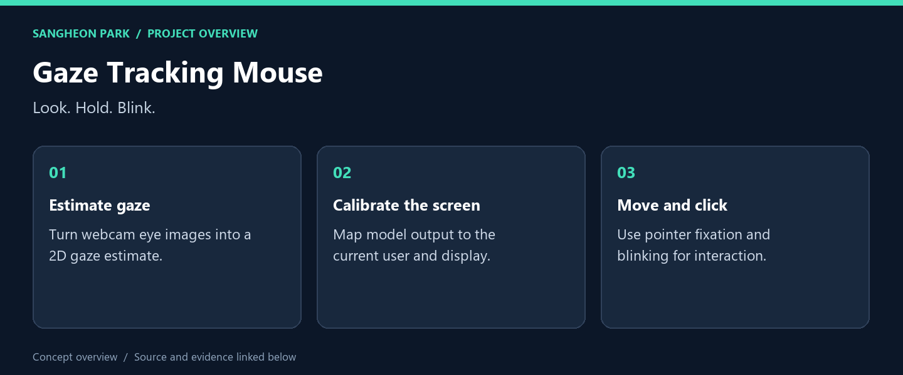
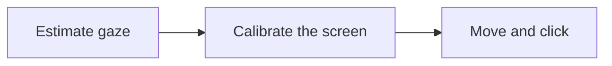

# Gaze Tracking Mouse

**A webcam-based mouse interface built with a teammate: gaze estimation, calibration and real-time interaction in one application.**

[What I built](#what-i-built) · [My role](#my-role) · [Code and reproduction](#code-and-reproduction) · [Portfolio](https://github.com/oldprize47-SH)

## What I built

| Deliverable | What it does | Explore |
|---|---|---|
| **Live interaction** | Webcam processing and pointer behaviour | [Source / result](main.py) |
| **Gaze model** | Neural gaze estimation | [Source / result](fginet.py) |
| **Calibration helpers** | Preprocessing and coordinate mapping | [Source / result](gaze_utils.py) |

### Result at a glance

Historical team report: 22–24 FPS and 67.71 px test MAE. Image-level split may leak nearby frames; these are internal reference values.

**[▶ Watch the original team demonstration](https://www.youtube.com/watch?v=VR9T6X-zanU)**

The linked video is the team’s original demonstration, not a newly recorded test.

## My role

I contributed jointly across data collection, the model and the real-time interface. The original report credits Sangheon Park and Sunwoo Kim; this fork preserves both authors and the original history.

## How it works

## Code and reproduction

## Demonstration and recorded results

[Watch the team demonstration](https://www.youtube.com/watch?v=VR9T6X-zanU).

The original report records validation MAE **66.77 px**, test MAE **67.71 px** and
**22–24 FPS**. Nearby frames may have crossed the image-level split; these are
internal reference values, not evidence of independent-user generalisation.

## Before running

Read `environment.yml` and the original report. The live script expects
`model_weights.pth` and user calibration, opens a webcam and controls the pointer.
It is not a hardware-free demo. The portfolio pass parsed the Python source without
executing camera or pointer actions; it did not retrain or remeasure the model.

The separate private curated snapshot remains private. This fork preserves the
already-public course repository; it does not publish additional private data.

## Source and credits

[Original repository](https://github.com/oldprize47/DLIP_FinalProject2025_GazeMouse) · [Portfolio home](https://github.com/oldprize47-SH)

[Original README](README.original.md) is retained alongside the source history.

Course scaffolding, team contributions and third-party assets retain their original attribution. This documentation does not grant a new licence.
