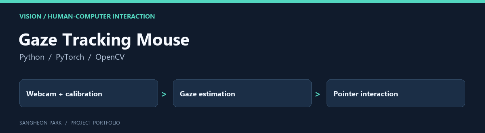

# Gaze Tracking Mouse

A two-person course project exploring webcam gaze estimation and mouse interaction without dedicated eye-tracking hardware.

[Portfolio home](https://github.com/oldprize47-SH) · [Original repository](https://github.com/oldprize47/DLIP_FinalProject2025_GazeMouse)

[Original project README](README.original.md)

## Contribution and context

I contributed jointly across data collection, the model and the real-time interface. The original report credits Sangheon Park and Sunwoo Kim; this fork preserves both authors and the original history.

## Code map

| Entry | Purpose |
|---|---|
| [main.py](main.py) | Real-time gaze, pointer fixation and blink interaction |
| [fginet.py](fginet.py) | Gaze model implementation |
| [gaze_utils.py](gaze_utils.py) | Eye preprocessing and calibration helpers |
| [environment.yml](environment.yml) | Recorded development environment |

## Demonstration and recorded results

[Watch the team demonstration](https://www.youtube.com/watch?v=VR9T6X-zanU).

The original report records validation MAE **66.77 px**, test MAE **67.71 px** and
**22–24 FPS**. Nearby frames may have crossed the image-level split; these are
internal reference values, not evidence of independent-user generalisation.

## Before running

Read `environment.yml` and the original report. The live script expects
`model_weights.pth` and user calibration, opens a webcam and controls the pointer.
It is not a hardware-free demo. The portfolio pass parsed the Python source without
executing camera or pointer actions; it did not retrain or remeasure the model.

The separate private curated snapshot remains private. This fork preserves the
already-public course repository; it does not publish additional private data.

## Archive policy

The fork retains upstream history, source attributions and course material. The
portfolio documentation does not assign a new licence or claim sole authorship
of inherited code. Current checks are stated above; an untested component is not
presented as verified.
